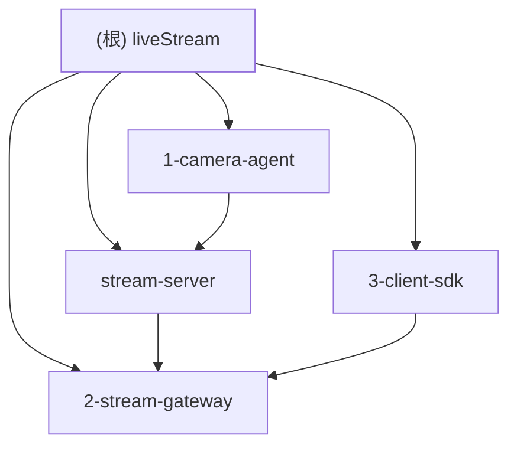

# CLAUDE.md

This file provides guidance to Claude Code (claude.ai/code) when working with code in this repository.

## 项目愿景

直播流平台，支持 camera-agent 推流、stream-server 协调服务、stream-gateway 流媒体网关、client-sdk 多协议播放器。

## 架构总览

```
liveStream/
├── 1-camera-agent/     # 推流端 Agent (Spring Boot + FFmpeg)
├── 2-stream-gateway/   # 流媒体网关 (对接 SRS/IVS)
├── stream-server/       # 协调服务 (WebSocket + Redis)
└── 3-client-sdk/       # 播放器 SDK (HLS/HTTPFLV/WebRTC)
```



## 模块索引

| 模块 | 路径 | 职责 | 语言/框架 |
|------|------|------|-----------|
| camera-agent | `liveStream/1-camera-agent/` | 推流端，接收 WS 命令控制 FFmpeg 推流到 RTMP | Java 17, Spring Boot 3.2.5 |
| stream-gateway | `liveStream/2-stream-gateway/` | 流媒体网关，对接 IVS/SRS 等流媒体服务器 | Java 17, Spring Boot 3.2.5 |
| stream-server | `liveStream/stream-server/` | 协调服务，HTTP API + WebSocket + Redis | Java 17, Spring Boot 3.2.5 |
| client-sdk | `liveStream/3-client-sdk/` | 播放器 SDK，支持 HLS/HTTPFLV/WebRTC | Java |

## 运行与开发

### 构建命令

从 `liveStream/` 目录执行：

```bash
# 构建所有模块
mvn clean package

# 构建特定模块
mvn clean package -pl 1-camera-agent -am
mvn clean package -pl 2-stream-gateway -am
mvn clean package -pl stream-server -am
mvn clean package -pl 3-client-sdk -am

# 运行模块
cd <module-dir> && mvn spring-boot:run
```

### 主要端口

- `stream-server`: 8080 (HTTP API + WebSocket `/ws/agent`)
- `stream-gateway`: 8081 (REST)
- `camera-agent`: 由远程 `stream-server` 控制

## 测试策略

当前状态：**无测试文件**
- 各模块均无 `src/test/java` 目录
- 建议优先为 stream-server 和 client-sdk 补充单元测试

## 编码规范

- Java 17
- Spring Boot 3.2.5
- Maven 构建
- 包命名: `cn.livestream.<module>`

## AI 使用指引

- 使用 context7 获取 Spring Boot / Java SDK 文档
- 项目为多模块 Maven 结构，模块间通过 WebSocket 通信
- camera-agent 为推流端，stream-server 为协调中心

## 变更记录 (Changelog)

- 2026-05-28: 初始化 CLAUDE.md，识别 4 个模块：camera-agent, stream-gateway, stream-server, client-sdk